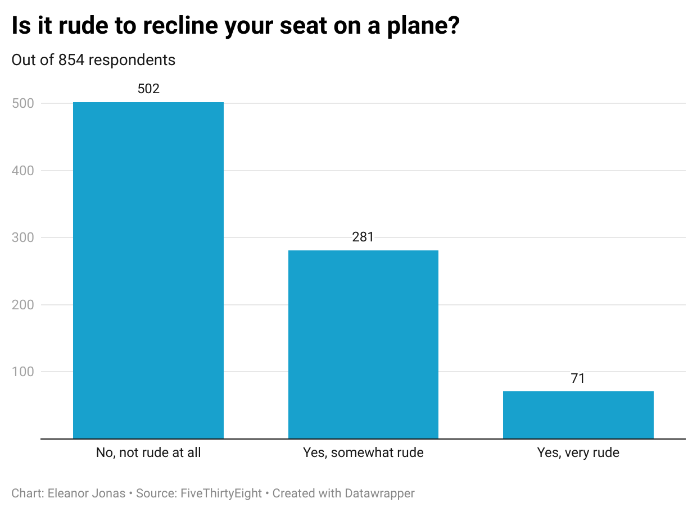

# Quiz Week 4

I chose the question about seat reclining because I think people who say it is rude are ridiculous. There was a lot of variety in what people think is proper etiquette in this data set, which I thought was interesting because usually I think of airplane etiquette as more or less agreed upon. One data point I thought was weird was that a large majority thought it was rude to knowingly bring an unruly child on a plane. What are they supposed to do, never fly anywhere? What if there is an event they need to fly to? Just dumb.

My chart shows that most people do not think it is rude to recline their seats, although there is still a significant amount who think it is at least somewhat rude.

